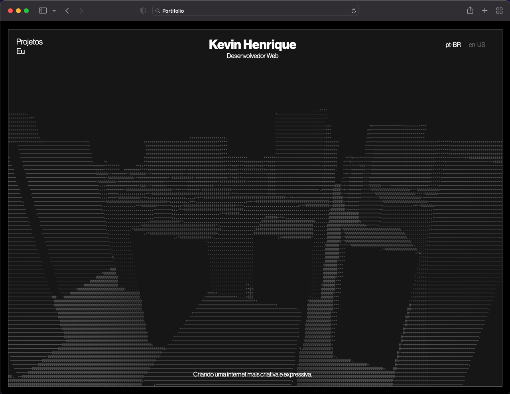
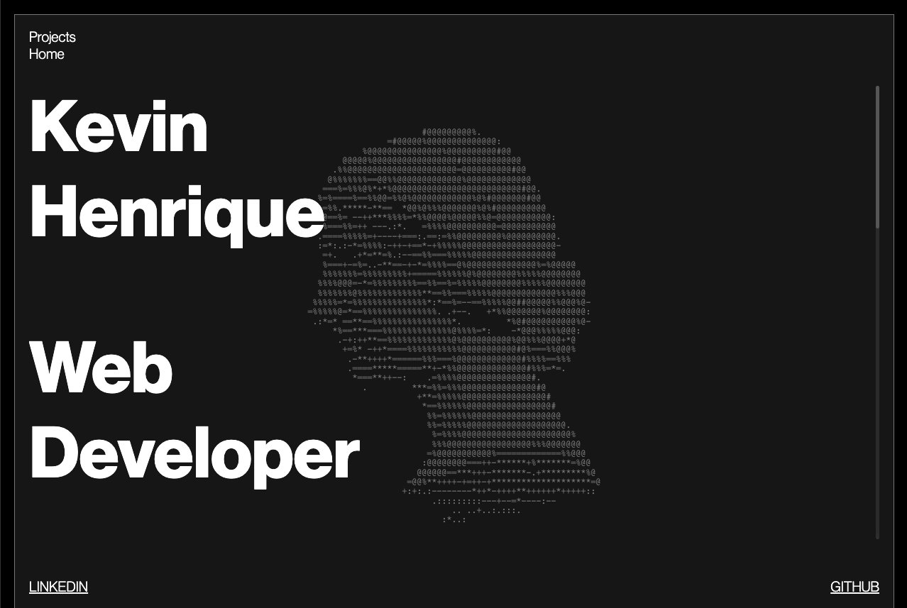

# kevi.site
Repo do meu portifolio.

### Funcionalidades
<ul>
  <li> Modelos 3D com animações no fundo. </ li>
  <li> Renderizador ASCII para os modelos.  </ li>
  <li> Duas linguagens : ENG e PT.  </ li>
</ul>

### Tecnologias e ferramentas
<ul>
  <li> ReactJS </ li>
  <li> ThreeJS </ li>
  <li> Fiber </ li>
  <li> Styled-Components </ li>
  <li> Framer Motion </ li>
  <li> i18next </ li>
</ul>

### App
Link para o <a href="https://kevi.site/"> Portifolio </a>.
